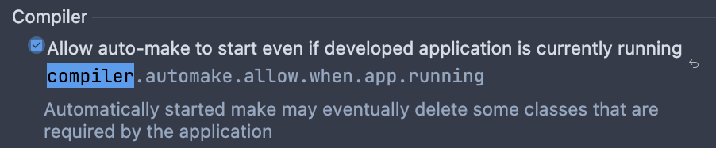

How to enable devtools in IntelliJ:
1. Add the following configuration onto the pom file:
```properties
<dependency>
    <groupId>org.springframework.boot</groupId>
    <artifactId>spring-boot-devtools</artifactId>
    <scope>runtime</scope>
    <optional>true</optional>
</dependency>
```
2. Under the section compiler, check the option: 

3. Finally, under advanced settings/compiler section, check the box:

